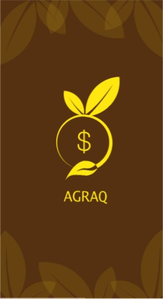
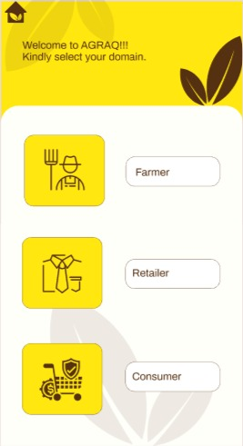
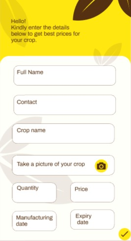
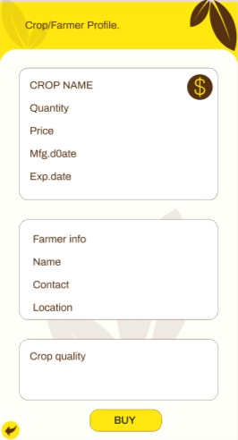
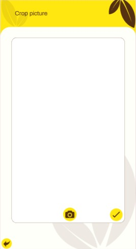
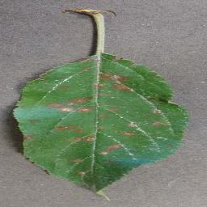

# AgraQ

The primary and persistent problem of Food and Agriculture sector in India is the inefficiency caused by information asymmetry that exists at various levels.

On the buyer's end their exists an uncertainity of what quality produce will they be getting for the price they paid. The farmer's are worried whether they get the right price for their crops and not be robbed of a decent price by the retailers as is the case in most parts of India.

This is where AgraQ can help, a comprehensive blockchain based solution which ensures their is transparency between the farmer, retailer and customer. With an easy to use and loaded with AI powered crop quality detection features, AgraQ ensures that the customer is getting his price justified by verifying the quality of the produce. The farmers also are guaranteed a fair price for their crops.

## The app

## Crop disease classifier

The captured picture

 

classified as Cedar rust in Apples